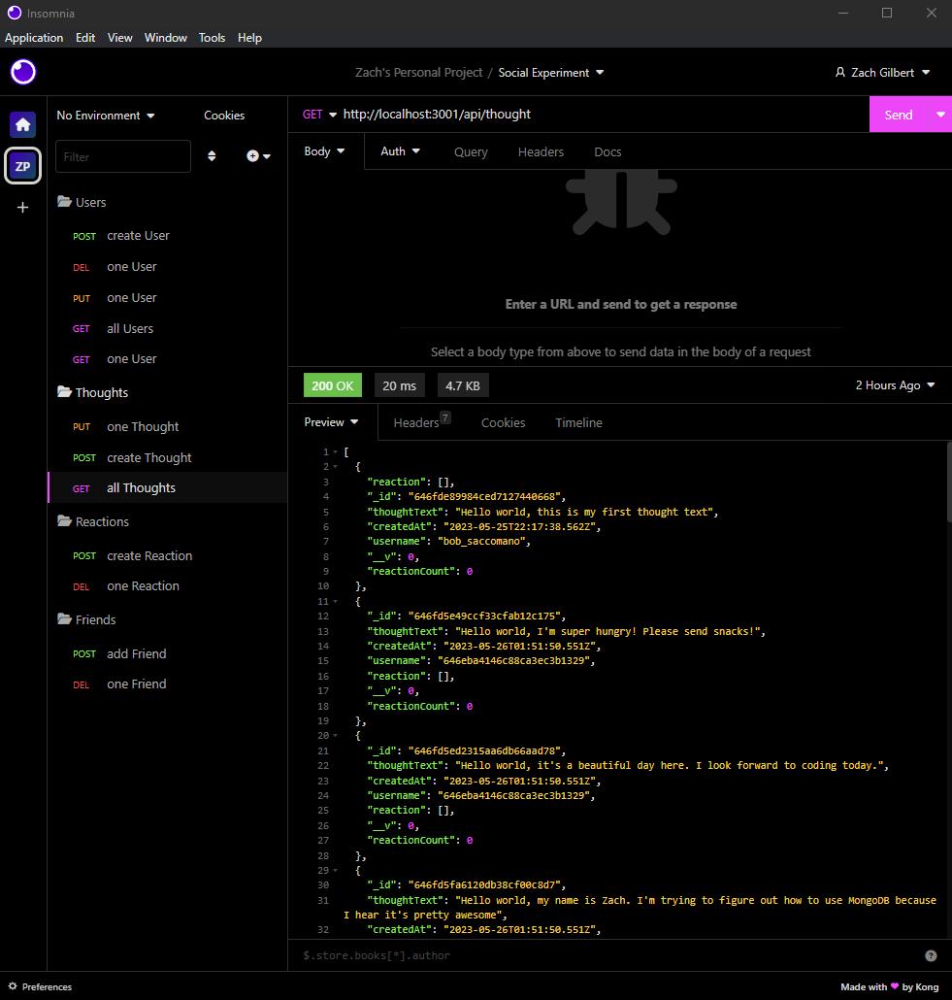
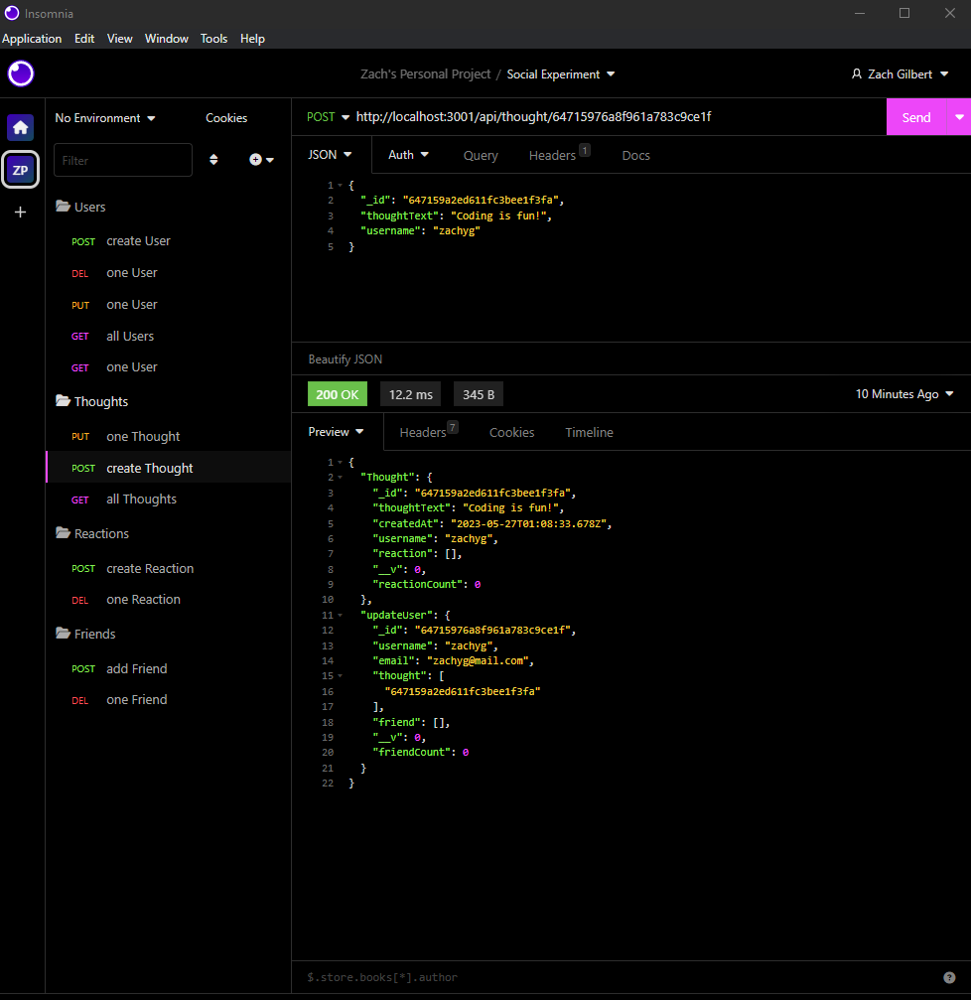
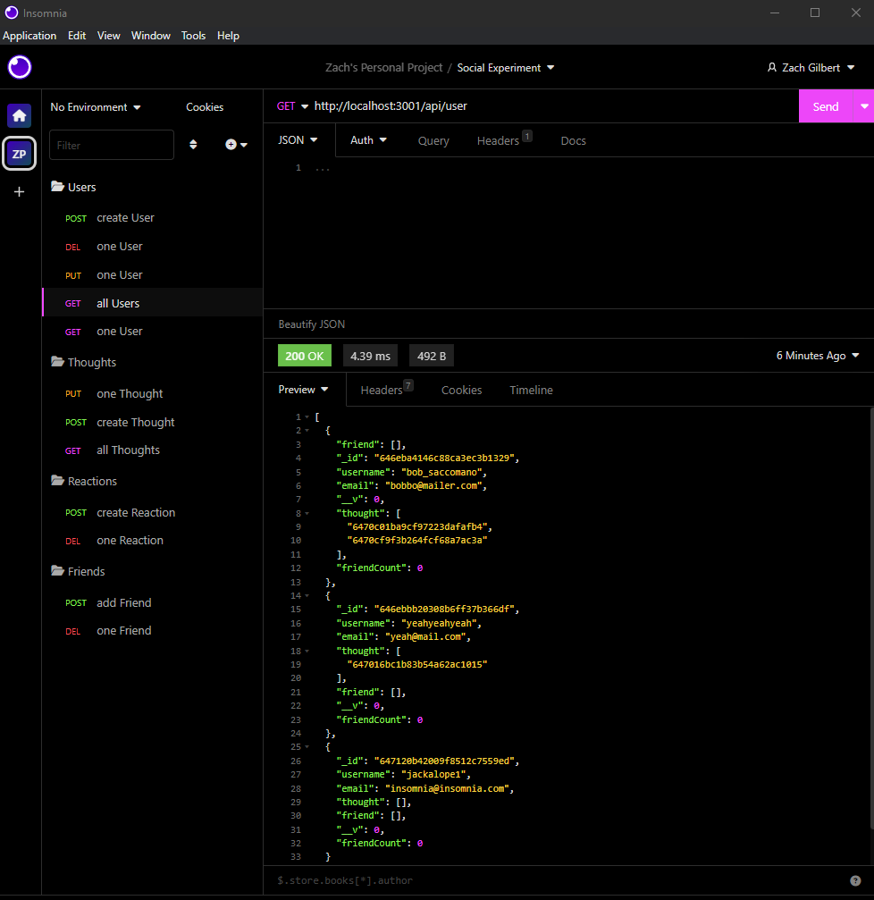

# Social App Experiment

## Description
My motivation for this small project was to "wet" my toes so to speak in the world of MongoDB, one of the most widely-used NoSQL databases.
I built this project in order to further my understanding of back-end web development and CRUD operations associated with the Mongoose Node program, which is a companion to the MongoDB database.
In my opinion social media effectively causes more problems than solutions; however, this program demonstrates how a barebones social media website/app would store user information server-side in a NoSQL environment.
I learned a lot, especially in regards to MongoDB and the syntax associated with the command line program - Mongoose - which is used to interact with the database.

## Table of Contents
### [Installation](#installation)
### [Usage](#usage)
### [Screenshots](#screenshots)
### [Contributions](#contributions)
### [Tests](#tests)
### [Questions](#questions)
### [License](#license)
## Installation
Because this app is shipped without a client-side it is necessary to use a local mock server to test the routing and database communication. Something like the Insomnia Restful API is a good choice.
## Usage
The user must send a request in json format while listening to PORT 3001 (or other available local port). This can be accomplished after installing the necessary node dependencies and running an npm start or npm run watch command in the command line at the root of the project (server.js).
## Screenshots & Walkthrough Video

Walkthrough Video: https://drive.google.com/file/d/1uflTGxUtAomyZSB37hj2iKcvkeISsQZ2/view

## Contributions
No outside collaborators were involved in this project.

The third-party programs used include: MongoDB, Insomnia Restful API, Node.js and associated packages.
No tutorials were used on this project.
## Tests
The entire program is essentially an entire test of the back-end capabilities of the code written for it and accompanying the README in this repo. The user may use JSON requests to test any of the available routes in Insomnia.

## Questions
Please direct any further questions to: buster35 or gilb9711@gmail.com.
## License
The license used for this project is MIT: https://choosealicense.com/licenses/mit/#.
